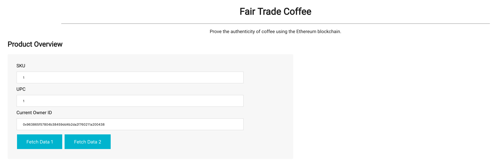
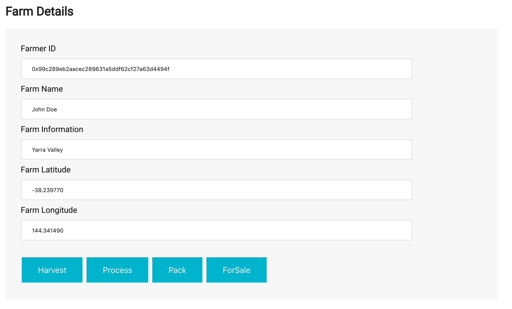
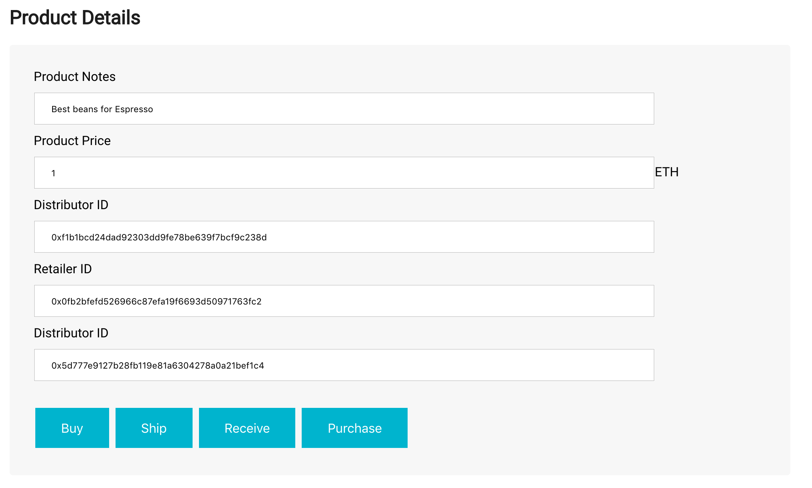
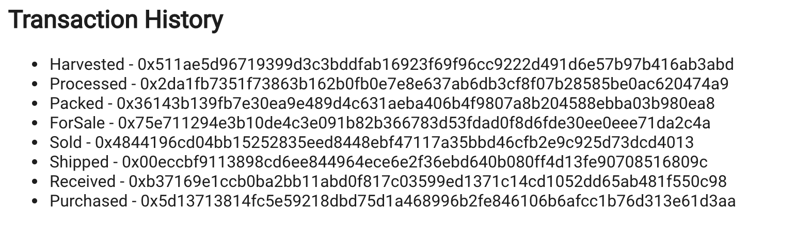

# Coffee Supply chain & data auditing

This repository containts an Ethereum DApp that demonstrates a Supply Chain flow between a Seller and Buyer. The user story is similar to any commonly used supply chain process. A Seller can add items to the inventory system stored in the blockchain. A Buyer can purchase such items from the inventory system. Additionally a Seller can mark an item as Shipped, and similarly a Buyer can mark an item as Received.

The DApp User Interface when running should look like...










## Getting Started

These instructions will get you a copy of the project up and running on your local machine for development and testing purposes. See deployment for notes on how to deploy the project on a live system.

### Prerequisites

Please make sure you've already installed ganache-cli, Truffle and enabled MetaMask extension in your browser.

```
node v8.12.0
ganache-cli v6.3.0
Truffle v4.1.15
MetaMask 6.0.1
```

### Installing

A step by step series of examples that tell you have to get a development env running

Clone this repository:

```
git clone git@github.com:Ebrahim-hamdy/blockchain-coffee-supply-chain.git
```

install all requisite npm packages (as listed in ```package.json```):

```
npm install Or
yarn install
```

Launch Ganache:

```
ganache-cli -m "idea exile obey monitor enlist harsh state cash mesh essay hope cricket"
```

In a separate terminal window, Compile smart contracts:

```
truffle compile
```

This will create the smart contract artifacts in folder ```build\contracts```.

Migrate smart contracts to the locally running blockchain, ganache-cli:

```
truffle migrate
```

Test smart contracts:

```
truffle test
```

All 10 tests should pass.


In a separate terminal window, launch the DApp:

```
npm run dev Or
yarn dev
```

## Deployment(Rinkeby)

```
Using network 'rinkeby'.

Running migration: 1_initial_migration.js
  Deploying Migrations...
  ... 0xfaab95234d949bac14e9983ecb81313688518b2ef2dbf49c60ee9d0f5695fb2a
  Migrations: 0x8644a4615b9174123e63ca02b1d2068f952f381d
Saving successful migration to network...
  ... 0xc320b1ddf80d70194a7212e88da9121c1c50e2b3163e067dd8b1392f7a804085
Saving artifacts...
Running migration: 2_deploy_contracts.js
  Deploying FarmerRole...
  ... 0x5e618464e399530ca6bf702fe29e16daa2bb8b083bfd373c499376e390580c27
  FarmerRole: 0x020dadab58cc4d28c8352465959303dc1332a9cb
  Deploying DistributorRole...
  ... 0xf2be5c5ce37e1cb8a6e5610ebee56c2519166abd51be5ec1eed504a024fc877e
  DistributorRole: 0x5c5c0d8e3e90868064527f906ae2b272abb77a76
  Deploying RetailerRole...
  ... 0x17a51b5c1911f29276e79426e097b1aeb8aacffeb18468626cf52b2b913c8a72
  RetailerRole: 0x1bbf1c68561647eeab9e965b2bb2ed63dcbf7fbe
  Deploying ConsumerRole...
  ... 0x3fc72dba97466b1d0da39618bad39644ef91076ecf020bcf6e1830fc8eb4bedc
  ConsumerRole: 0x64bb87b834581f280f73d39221bb90b7b1091dee
  Deploying SupplyChain...
  ... 0x955778f9ee6fc2c9c13dfb4f878b0f7a07042f558baa1737b0a9cdc233fa9b90
  SupplyChain: 0x25dca49e956dd07ee1b717c1819cc0278645e1e2
Saving successful migration to network...
  ... 0x2a389d2fef3a6c2a2a76f60ecdd8ef71155368c510b35e3fd183fcd2d5e2253e
```

## Built With

* [Ethereum](https://www.ethereum.org/) - Ethereum is a decentralized platform that runs smart contracts
* [IPFS](https://ipfs.io/) - IPFS is the Distributed Web | A peer-to-peer hypermedia protocol
to make the web faster, safer, and more open.
* [Truffle Framework](http://truffleframework.com/) - Truffle is the most popular development framework for Ethereum with a mission to make your life a whole lot easier.

## Acknowledgments

* Solidity
* Ganache-cli
* Truffle
* IPFS
